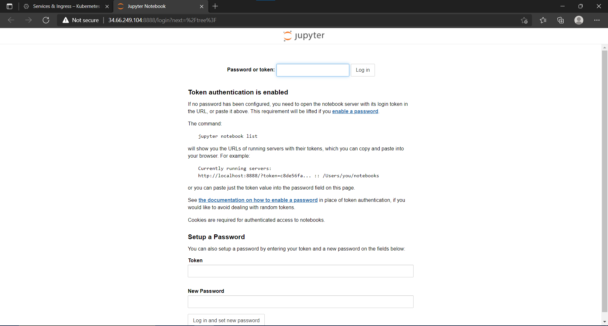
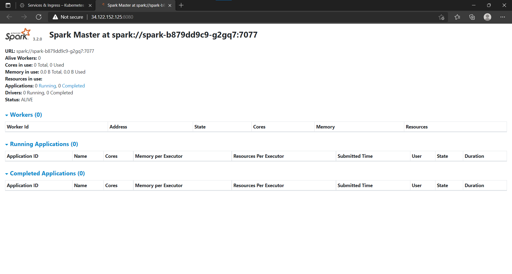
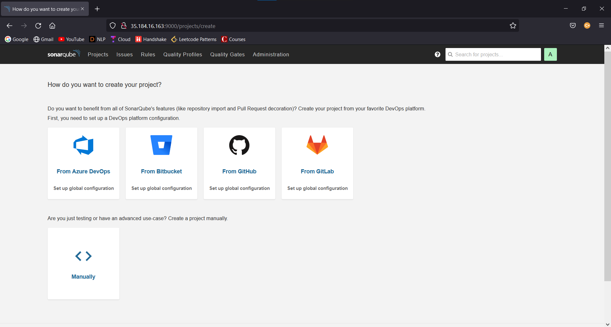
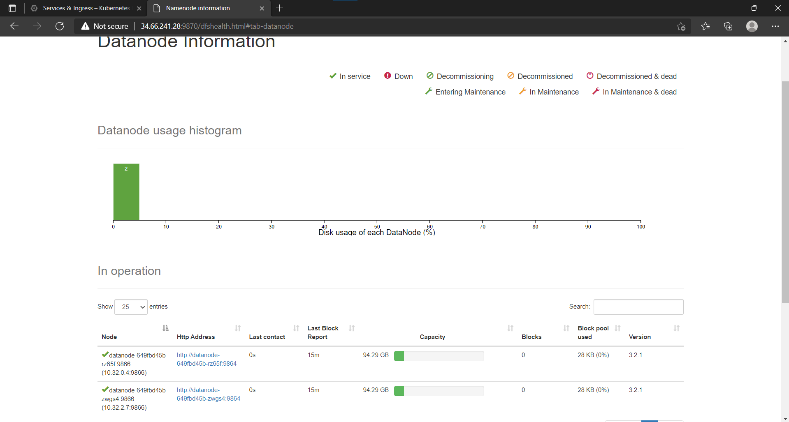
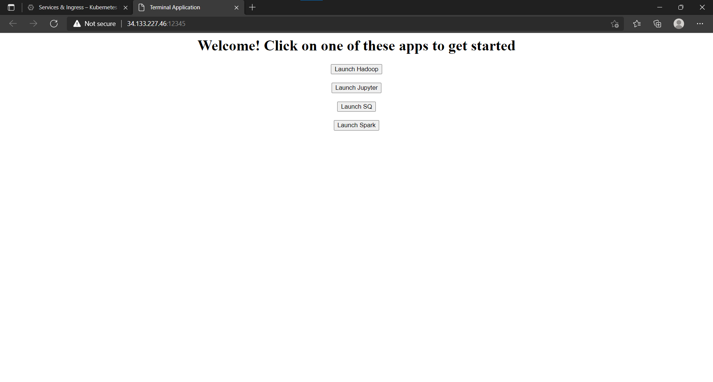
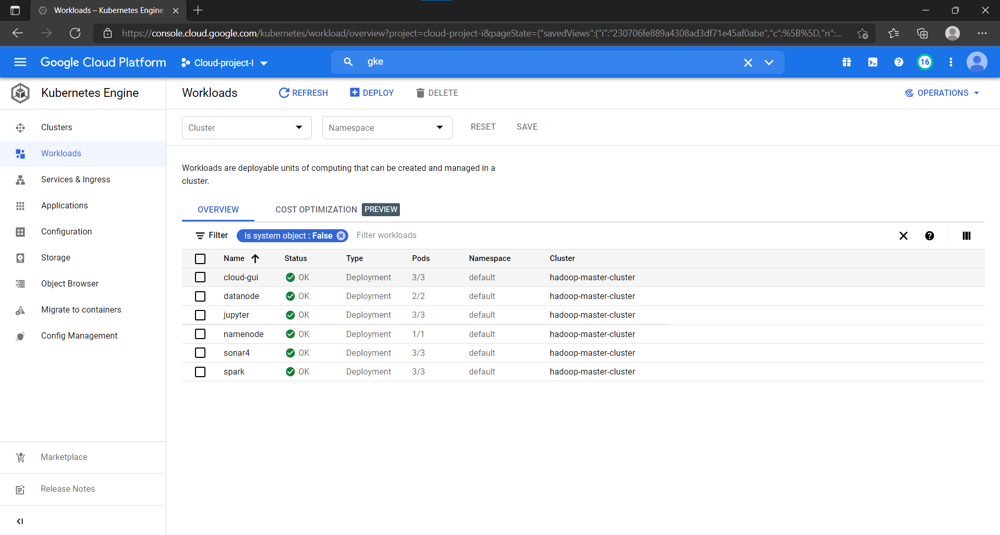
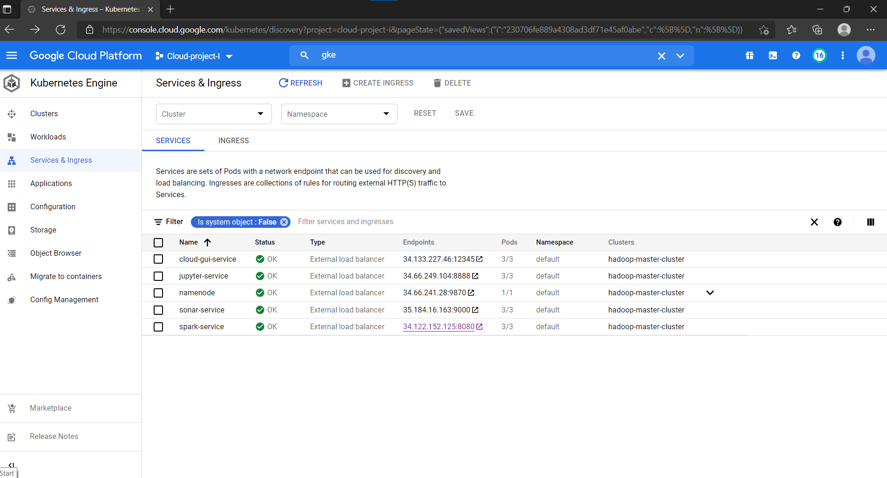

# 14848_project

Here is the list of all docker images used for this project -

1. Jupyter - https://hub.docker.com/r/jupyter/minimal-notebook
2. Hadoop worker - https://hub.docker.com/r/bde2020/hadoop-datanode
3. Hadoop master - https://hub.docker.com/r/bde2020/hadoop-namenode
4. Spark - https://hub.docker.com/r/bitnami/spark
5. Sonar - https://hub.docker.com/r/ramadasmahale/sonarscanner (My docker image) - (To build this docker image yourself, you need to download the zip from - https://binaries.sonarsource.com/Distribution/sonar-scanner-cli/sonar-scanner-cli-4.6.2.2472-linux.zip , unzp it and place it in the sonar folder. Couldn't upload the zip to github due to size restrictions)
6. Cloud UI - https://hub.docker.com/r/ramadasmahale/cloud-gui (My docker image)

## Steps to deploy all the images ->

All these deployments have been made on GCP's Kubernetes Engine. Hence, before getting started, create a new project and enable Kubernetes Engine on the project. Once done, perform the following steps - 

### Jupyter 

1. Pull the cloud UI into GCP using - `docker pull jupyter/minimal-notebook` . Tag the image according to GCP conventions and push to container registry
2. Create a new deployment on GKE by selecting the above deployment. While creating the deployment, leave the default values as is. 
3. Once the deployment is created, expose this as a Loadbalancer service. Be sure to map port 8888 to required port(left to 8888 here) while creating the service.
4. Once the service is created, navigate to the URL and you must see - 

### Spark

1. Pull the cloud UI into GCP using - `docker pull bitnami/spark` . Tag the image according to GCP conventions and push to container registry
2. Create a new deployment on GKE by selecting the above deployment. While creating the deployment, add the env variable `SPARK_MODE` and set it to `master`
3. Once the deployment is created, expose this as a Loadbalancer service. Be sure to map port 8080 to required port(left to 8080 here) while creating the service.
4. Once the service is created, navigate to the URL and you must see - 

### Sonar

1. Pull the cloud UI into GCP using - `docker pull ramadasmahale/sonarscanner` . Tag the image according to GCP conventions and push to container registry.
2. Create a new deployment on GKE by selecting the above deployment.  While creating the deployment, leave the default values as is.
3. Once the deployment is created, expose this as a Loadbalancer service. Be sure to map port 9000 to required port(left to 9000 here) while creating the service.
4. Once the service is created, navigate to the URL and you must see - 

### Hadoop master
1. Pull the cloud UI into GCP using - `docker pull bde2020/hadoop-namenode` . Tag the image according to GCP conventions and push to container registry
2. Create a new deployment on GKE by selecting the above deployment. While creating the deployment, set the env variable CLUSTER_NAME appropriately (set to test here). Also add all the environment variables in the `hadoop.env` file here. Also be sure to change the number of replicas of deployment = 1 as we need only 1 master for this project.
3. Once the deployment is created, expose this as a Loadbalancer service. Be sure to map port 9874 and 9000 to required ports(left to 9874 and 9000 here) while creating the service.
4. Once the service is created, navigate to the service, you must see the UI as shown in the Hadoop worker step with zero live nodes0.

### Hadoop worker
1. Pull the cloud UI into GCP using - `docker pull bde2020/hadoop-datanode` . Tag the image according to GCP conventions and push to container registry
2. Create a new deployment on GKE by selecting the above deployment.  While creating the deployment, set the env variable SERVICE_PRECONDITION to http://namenode-service:9870 (replace the namenode-service with the master node's service name). Also add all the environment variables in the `hadoop.env` file here.
3.  Make sure that you change number of replicas to 2 as that is the configuration we need for this project

After both master and worker nodes are detailed above, we should see the following after navigating to the master node's service -

### Cloud UI
1. After noting down all the IP adresses of the services deployed so far, wtite a HTML/JS page with buttons such that clicking on each button redirects us to the appropriate service.
2. Create a docker image, push it to docker hub using `docker push`. (Here I have pushed it using `docker push ramadasmahale/cloud-gui`)
3. Pull the cloud UI into GCP using - `docker pull ramadasmahale/cloud-gui` . Tag the image according to GCP conventions and push to container registry
4. Create a new deployment on GKE by selecting the above deployment. While creating the deployment, leave the default values as is. 
5. Once the deployment is created, expose this as a Loadbalancer service. Be sure to map port 80 to required port(12345 here) while creating the service.
6. Once the service is created, navigate to the URL and you must see - 

### Summary

On following all the above steps, you must see the following in your GKE ->

Deployments ->

Services -> 

